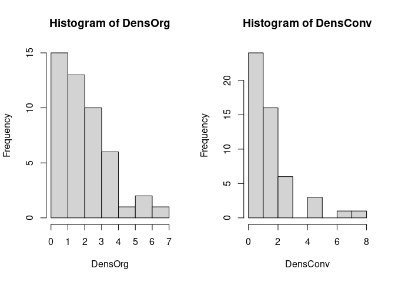
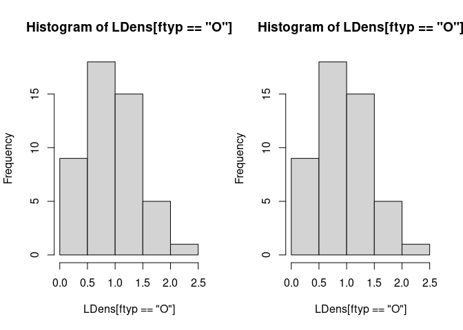
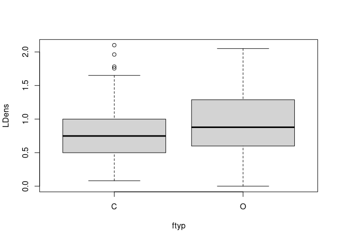

StatsNotes
================
Matteo Angeli
2023-12-29

## Revision

<u>Parametric tests</u> ⇒ validity depends on the data distribution

- Compare means of two samples == t-test
- Compare means of three or more samples == ANOVA
- Assess the association between two continuous variables == correlation
- Assess the association between categorical variables == Chi-square

<u>What are the assumptions?</u>

1.  Normal distribution </br> ⇒ data are symmetrical about the mean:
    Mean = Mode = Median
2.  Independent data points
3.  Homogeneity of variance

<u>Standard error</u> $SE=\frac{s} {\sqrt{N}}$

68% of sample means lie within ± 1 SE of m   \[green\]

95% of sample means lie within ± 1.96 SE of m  \[red\]

→ m is the true population mean - in this case m=0


There is a 95% chance that an observation drawn at random from the
population will be within 1.96 x SE of the true population mean.

There is only a 5% chance of a random observation occurring outside this
range – this is the basis of the 0.05 significance level.

<u>What if the data are not normally distributed?</u>

- Transform the data \[ log ; log+1 ; square-root \]

- Use a statistical test that doesn’t require a normal distribution

- Specify a different data distribution in a GLM (we’ll look at this in
  later lessons)

<u>Non-parametric tests</u> —\> for ordinal data or for data when
transformations don’t work

|                             |                       |
|-----------------------------|-----------------------|
| Mann-Whitney U test         | unpaired t-test       |
| Kruskal-Wallis test         | unpaired t-test       |
| Kruskal-Wallis test         | paired t-test         |
| Wilcoxon matched pairs test | one-way ANOVA         |
| Friedman test               | two-way ANOVA         |
| Spearman correlation        | Pearson’s correlation |
| Kendall correlation         | Pearson’s correlation |

``` r
# R tips:
# first clean the environment and call every package you will use
rm(list=ls())
library(package)
# explore data first of all, and plot data to check for errors 
# or zero-inflation
str()
head()
hist()
summary()
# two graphs same row
par(mfrow=c(2,2))
```

**Exercise 1:** Is there a difference in bird density between organic
and conventional farms in the winter? \[*Organic.txt*\]

``` r
data<-read.table("/home/matteo/GitHub_BioTheo/StatsNotes/Notes_files/database/Organic.txt", header=TRUE, sep=",")
attach(data)
head(data)
```

    ##   site ftyp X_TYPE_ X_FREQ_      count    area     dens
    ## 1    1    C       0       3  42.333333 38.0412 1.112829
    ## 2    1    O       0       3  51.000000 27.7992 1.834585
    ## 3   10    C       0       4 151.250000 68.5872 2.205222
    ## 4  152    C       0       4 122.250000 68.4828 1.785120
    ## 5  152    O       0       2 122.000000 35.0928 3.476497
    ## 6   16    C       0       3   8.666667  7.2576 1.194150

``` r
# first of all we need to evaluate the distribution of the two variables
# to make it, we will print their frequency distribution graphs 

DensOrg<-(dens[ftyp=="O"])
DensConv<-(dens[ftyp=="C"])

par(mfrow=c(1,2))
hist(DensOrg)
hist(DensConv)
```

<!-- -->

``` r
# both of them are not normally distributed, so we will transform them with in log(x+1) scale

LDens<-log(dens+1)

par(mfrow=c(1,2))          # split the plot environment
hist(LDens[ftyp=="O"])
hist(LDens[ftyp=="O"])
```

<!-- -->

``` r
# now they are normally distributed, is there a difference between the mean of the two samples?

t.test(LDens ~ ftyp, var.equal=T)
```

    ## 
    ##  Two Sample t-test
    ## 
    ## data:  LDens by ftyp
    ## t = -1.3768, df = 97, p-value = 0.1717
    ## alternative hypothesis: true difference in means between group C and group O is not equal to 0
    ## 95 percent confidence interval:
    ##  -0.33129677  0.05991152
    ## sample estimates:
    ## mean in group C mean in group O 
    ##       0.8030012       0.9386938

``` r
# p-value = 0.1717, there's a difference

# Answer: yes, there is a statistical difference in bird density between organic and conventional farms in winter

par(mfrow=c(1,1))             # restore default plot environment (you can also use > dev.off() )
boxplot(LDens ~ ftyp)         # as the boxplot shows too
```

<!-- -->

## Analysis of Variance

⇒ Testing the difference between three or more means Why can’t we just
do a series of t-tests? —\> Type I & II errors

- Type I error is *false positive*
- Type II error is *false negative*

> We accept a level of significance of P = 0.05, in other words \<5%
> chance that we have a Type I error </br> So we implicitly accept that
> 5% (or 1 in 20) of the time we will have a Type I error </br> If we
> increase the number of tests on the same dataset, we inflate the
> probability of a Type I error e.g. comparing three groups by running 3
> t-tests results in a 14.3% chance of a Type I error.
