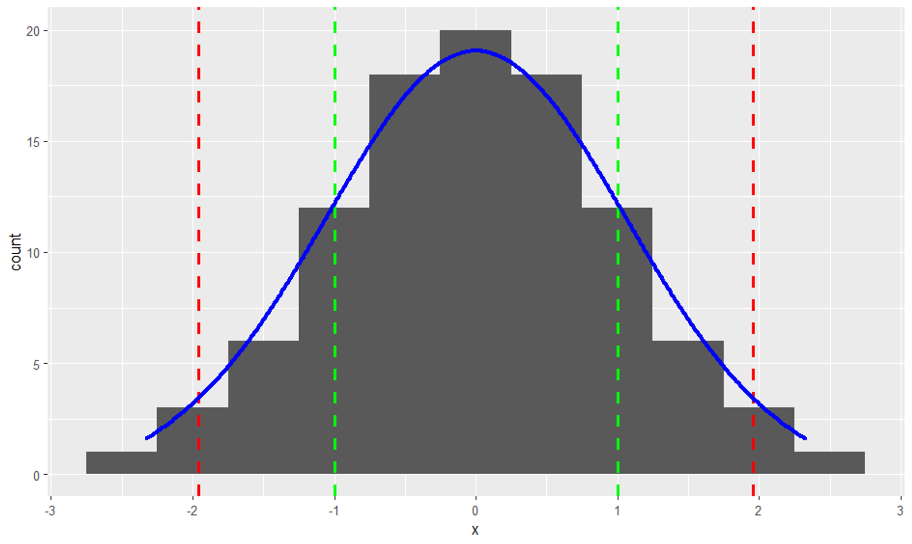
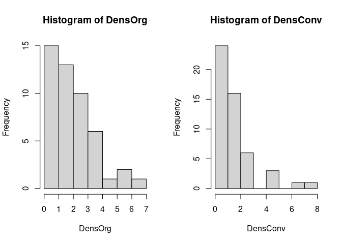
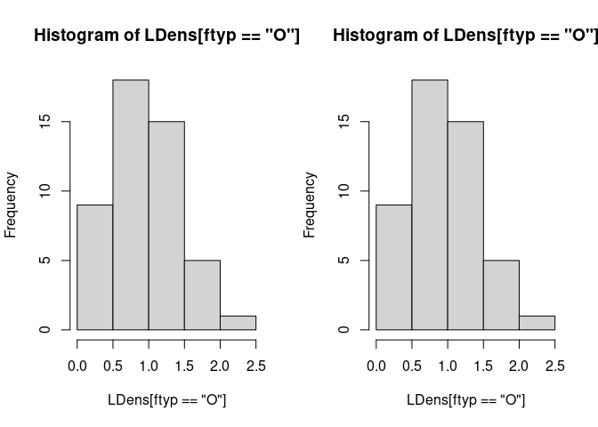
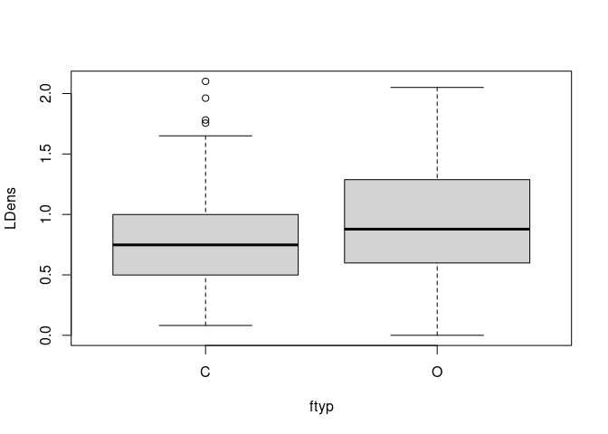
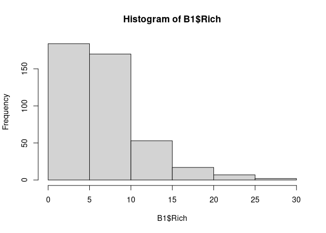
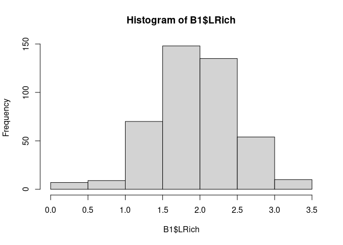
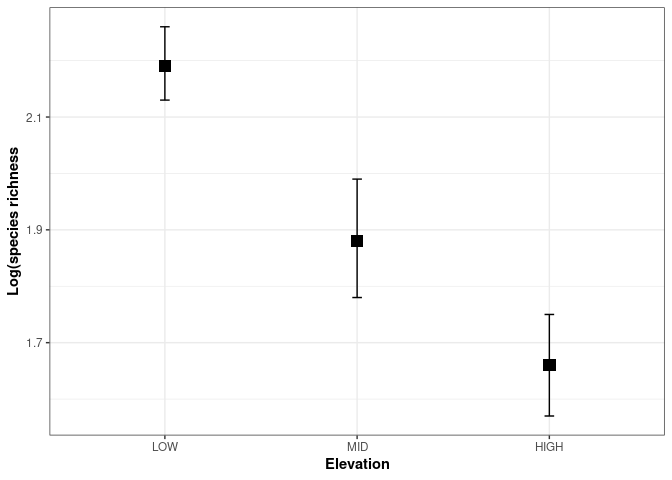

StatsNotes
================
Matteo Angeli
2023-12-29

## Revision

<u>Parametric tests</u> ⇒ validity depends on the data distribution

- Compare means of two samples == t-test
- Compare means of three or more samples == ANOVA
- Assess the association between two continuous variables == correlation
- Assess the association between categorical variables == Chi-square

<u>What are the assumptions?</u>

1.  Normal distribution </br> ⇒ data are symmetrical about the mean:
    Mean = Mode = Median
2.  Independent data points
3.  Homogeneity of variance

<u>Standard error</u> $SE=\frac{s} {\sqrt{N}}$

68% of sample means lie within ± 1 SE of m   \[green\]

95% of sample means lie within ± 1.96 SE of m  \[red\]

→ m is the true population mean - in this case m=0

<figure>

<figcaption aria-hidden="true">Standard Error</figcaption>
</figure>

There is a 95% chance that an observation drawn at random from the
population will be within 1.96 x SE of the true population mean.

There is only a 5% chance of a random observation occurring outside this
range – this is the basis of the 0.05 significance level.

<u>What if the data are not normally distributed?</u>

- Transform the data \[ log ; log+1 ; square-root \]

- Use a statistical test that doesn’t require a normal distribution

- Specify a different data distribution in a GLM (we’ll look at this in
  later lessons)

<u>Non-parametric tests</u> —\> for ordinal data or for data when
transformations don’t work

|                             |                       |
|-----------------------------|-----------------------|
| Mann-Whitney U test         | unpaired t-test       |
| Kruskal-Wallis test         | unpaired t-test       |
| Kruskal-Wallis test         | paired t-test         |
| Wilcoxon matched pairs test | one-way ANOVA         |
| Friedman test               | two-way ANOVA         |
| Spearman correlation        | Pearson’s correlation |
| Kendall correlation         | Pearson’s correlation |

``` r
# R tips:
# first clean the environment and call every package you will use
rm(list=ls())
library(package)
# explore data first of all, and plot data to check for errors 
# or zero-inflation
str()
head()
hist()
summary()
# two graphs same row
par(mfrow=c(2,2))
```

**Exercise 1:** Is there a difference in bird density between organic
and conventional farms in the winter? \[*Organic.txt*\]

``` r
data<-read.table("Notes_files/dataset/Organic.txt", header=TRUE, sep=",")
attach(data)
head(data)
```

    ##   site ftyp X_TYPE_ X_FREQ_      count    area     dens
    ## 1    1    C       0       3  42.333333 38.0412 1.112829
    ## 2    1    O       0       3  51.000000 27.7992 1.834585
    ## 3   10    C       0       4 151.250000 68.5872 2.205222
    ## 4  152    C       0       4 122.250000 68.4828 1.785120
    ## 5  152    O       0       2 122.000000 35.0928 3.476497
    ## 6   16    C       0       3   8.666667  7.2576 1.194150

``` r
# first of all we need to evaluate the distribution of the two variables
# to make it, we will print their frequency distribution graphs 

DensOrg<-(dens[ftyp=="O"])
DensConv<-(dens[ftyp=="C"])

par(mfrow=c(1,2))
hist(DensOrg)
hist(DensConv)
```

<!-- -->

``` r
# both of them are not normally distributed, so we will transform them with in log(x+1) scale

LDens<-log(dens+1)

par(mfrow=c(1,2))          # split the plot environment
hist(LDens[ftyp=="O"])
hist(LDens[ftyp=="O"])
```

<!-- -->

``` r
# now they are normally distributed, is there a difference between the mean of the two samples?

t.test(LDens ~ ftyp, var.equal=T)
```

    ## 
    ##  Two Sample t-test
    ## 
    ## data:  LDens by ftyp
    ## t = -1.3768, df = 97, p-value = 0.1717
    ## alternative hypothesis: true difference in means between group C and group O is not equal to 0
    ## 95 percent confidence interval:
    ##  -0.33129677  0.05991152
    ## sample estimates:
    ## mean in group C mean in group O 
    ##       0.8030012       0.9386938

``` r
# p-value = 0.1717, there's a difference

# Answer: yes, there is a statistical difference in bird density between organic and conventional farms in winter

par(mfrow=c(1,1))             # restore default plot environment (you can also use > dev.off() )
boxplot(LDens ~ ftyp)         # as the boxplot shows too
```

<!-- -->

## Analysis of Variance

⇒ Testing the difference between three or more means Why can’t we just
do a series of t-tests? —\> Type I & II errors

- Type I error is *false positive*
- Type II error is *false negative*

> We accept a level of significance of P = 0.05, in other words \<5%
> chance that we have a Type I error </br> So we implicitly accept that
> 5% (or 1 in 20) of the time we will have a Type I error </br> If we
> increase the number of tests on the same dataset, we inflate the
> probability of a Type I error </br> e.g. comparing three groups by
> running 3 t-tests results in a 14.3% chance of a Type I error.

**Example**: carabid species richess at different elevation zones \[
*Rich_final.csv* \]

``` r
library(ggplot2)
library(dplyr)
```

    ## 
    ## Attaching package: 'dplyr'

    ## The following objects are masked from 'package:stats':
    ## 
    ##     filter, lag

    ## The following objects are masked from 'package:base':
    ## 
    ##     intersect, setdiff, setequal, union

``` r
B1<-read.table("Notes_files/dataset/Rich_final.csv",
               sep=";", header=T)
str(B1)
```

    ## 'data.frame':    433 obs. of  7 variables:
    ##  $ Point : chr  "100ValSessera" "101ValSessera" "102ValSessera" "103ValSessera" ...
    ##  $ Alt   : int  1604 1587 1628 1624 1607 1603 1307 1178 1125 1118 ...
    ##  $ Traps : int  5 5 5 5 5 5 5 5 5 5 ...
    ##  $ Days  : int  120 120 120 120 120 120 120 120 120 120 ...
    ##  $ Rich  : int  10 7 10 11 13 10 8 6 5 7 ...
    ##  $ Site  : chr  "ValSessera" "ValSessera" "ValSessera" "ValSessera" ...
    ##  $ Region: chr  "NWAlps" "NWAlps" "NWAlps" "NWAlps" ...

``` r
summary(B1$Alt)
```

    ##    Min. 1st Qu.  Median    Mean 3rd Qu.    Max. 
    ##     697    1423    1897    1851    2245    2840

``` r
#Define altitude groups based on deciduous, coniferous and above the treeline (approximately)
B1$AltCat <- cut(B1$Alt, breaks=c(0, 1700, 2201, 2840), labels=c("LOW", "MID", "HIGH"), right  = FALSE,
                 include.lowest = TRUE)   
head(B1)
```

    ##           Point  Alt Traps Days Rich       Site Region AltCat
    ## 1 100ValSessera 1604     5  120   10 ValSessera NWAlps    LOW
    ## 2 101ValSessera 1587     5  120    7 ValSessera NWAlps    LOW
    ## 3 102ValSessera 1628     5  120   10 ValSessera NWAlps    LOW
    ## 4 103ValSessera 1624     5  120   11 ValSessera NWAlps    LOW
    ## 5 104ValSessera 1607     5  120   13 ValSessera NWAlps    LOW
    ## 6 105ValSessera 1603     5  120   10 ValSessera NWAlps    LOW

``` r
#Look at means, sd and sample sizes for each group (need dplyr for this)
group_by(B1, AltCat) %>%
  summarise(
    n = n(),
    mean = mean(Rich, na.rm = TRUE),
    sd = sd(Rich, na.rm = TRUE)
  )
```

    ## # A tibble: 3 × 4
    ##   AltCat     n  mean    sd
    ##   <fct>  <int> <dbl> <dbl>
    ## 1 LOW      168  8.88  5.01
    ## 2 MID      151  6.95  4.71
    ## 3 HIGH     114  4.86  2.51

``` r
#Look at distribution - it's not normal (but advisory to log-transform count data anyway)
hist(B1$Rich)
```

<!-- -->

``` r
B1$LRich <- log(B1$Rich+1)
hist(B1$LRich)
```

<!-- -->

``` r
#Much better now!
#We can now analyse the data using the function aov
#Note that first we have to give the model (for that is what it is!) a name 
#(then we can refer to it in other steps)
#In this case, I've called it ANOVA1
ANOVA1 <- aov(LRich ~ AltCat, data = B1)
summary(ANOVA1)
```

    ##              Df Sum Sq Mean Sq F value   Pr(>F)    
    ## AltCat        2  20.05  10.026    34.8 9.81e-15 ***
    ## Residuals   430 123.89   0.288                     
    ## ---
    ## Signif. codes:  0 '***' 0.001 '**' 0.01 '*' 0.05 '.' 0.1 ' ' 1

``` r
#Post-hoc test
TukeyHSD(ANOVA1)
```

    ##   Tukey multiple comparisons of means
    ##     95% family-wise confidence level
    ## 
    ## Fit: aov(formula = LRich ~ AltCat, data = B1)
    ## 
    ## $AltCat
    ##                diff        lwr         upr     p adj
    ## MID-LOW  -0.3100614 -0.4516215 -0.16850134 0.0000012
    ## HIGH-LOW -0.5311304 -0.6843118 -0.37794894 0.0000000
    ## HIGH-MID -0.2210689 -0.3776974 -0.06444048 0.0028088

This ask the question: do all groups come from populations with the same
mean? NO! p-value \> 0.05

``` r
library(rcompanion)
SUMMARY = groupwiseMean(LRich ~ AltCat,
                        data   = B1,
                        conf   = 0.95,
                        digits = 3)

ggplot(SUMMARY,                
       aes(x = AltCat,
           y = Mean)) +
  geom_errorbar(aes(ymin = Trad.lower,
                    ymax = Trad.upper),
                width = 0.05, 
                size  = 0.5) +
  geom_point(shape = 15, 
             size  = 4) +
  theme_bw() +
  theme(axis.title   = element_text(face  = "bold")) +
  
  ylab("Log(species richness") + 
  xlab("Elevation")
```

    ## Warning: Using `size` aesthetic for lines was deprecated in ggplot2 3.4.0.
    ## ℹ Please use `linewidth` instead.
    ## This warning is displayed once every 8 hours.
    ## Call `lifecycle::last_lifecycle_warnings()` to see where this warning was
    ## generated.

<!-- -->

### Introducing the linear model

``` r
ANOVA2 <- lm(LRich ~ AltCat, data=B1)

anova(ANOVA2) #for the F-test, i.e. is there an overall effect of elevation?
```

    ## Analysis of Variance Table
    ## 
    ## Response: LRich
    ##            Df  Sum Sq Mean Sq F value    Pr(>F)    
    ## AltCat      2  20.053 10.0264  34.801 9.808e-15 ***
    ## Residuals 430 123.886  0.2881                      
    ## ---
    ## Signif. codes:  0 '***' 0.001 '**' 0.01 '*' 0.05 '.' 0.1 ' ' 1

``` r
summary(ANOVA2) #for contrasts between the different groups
```

    ## 
    ## Call:
    ## lm(formula = LRich ~ AltCat, data = B1)
    ## 
    ## Residuals:
    ##     Min      1Q  Median      3Q     Max 
    ## -1.8816 -0.2742  0.0056  0.3733  1.3373 
    ## 
    ## Coefficients:
    ##             Estimate Std. Error t value Pr(>|t|)    
    ## (Intercept)  2.19163    0.04141  52.923  < 2e-16 ***
    ## AltCatMID   -0.31006    0.06019  -5.151 3.95e-07 ***
    ## AltCatHIGH  -0.53113    0.06513  -8.155 3.88e-15 ***
    ## ---
    ## Signif. codes:  0 '***' 0.001 '**' 0.01 '*' 0.05 '.' 0.1 ' ' 1
    ## 
    ## Residual standard error: 0.5368 on 430 degrees of freedom
    ## Multiple R-squared:  0.1393, Adjusted R-squared:  0.1353 
    ## F-statistic:  34.8 on 2 and 430 DF,  p-value: 9.808e-15
