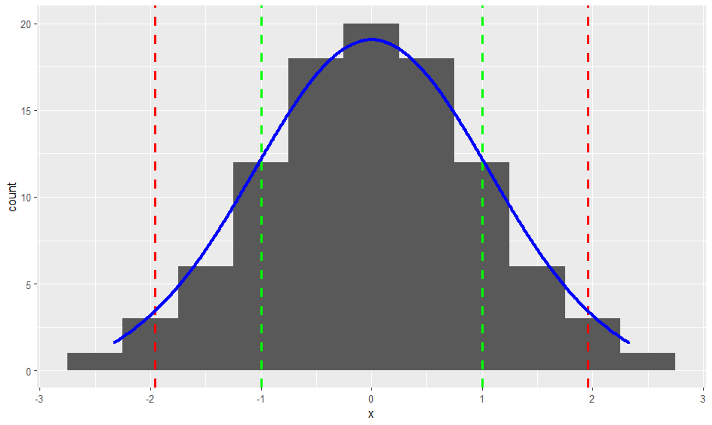

```{r setup, include=FALSE}
knitr::opts_chunk$set(echo = TRUE)
```

## Revision

<u>Parametric tests</u> ⇒ validity depends on the data distribution

-   Compare means of two samples == t-test
-   Compare means of three or more samples == ANOVA
-   Assess the association between two continuous variables == correlation
-   Assess the association between categorical variables == Chi-square

<u>What are the assumptions?</u>

1.  Normal distribution </br> ⇒ data are symmetrical about the mean: Mean = Mode = Median
2.  Independent data points
3.  Homogeneity of variance

<u>Standard error</u> $SE=\frac{s} {\sqrt{N}}$

68% of sample means lie within ± 1 SE of m   [green]

95% of sample means lie within ± 1.96 SE of m  [red]

→ m is the true population mean - in this case m=0

{width="1420"}

There is a 95% chance that an observation drawn at random from the population will be within 1.96 x SE of the true population mean.

There is only a 5% chance of a random observation occurring outside this range – this is the basis of the 0.05 significance level.

[What if the data are not normally distributed?]{.underline}

-   Transform the data [ log ; log+1 ; square-root ]

-   Use a statistical test that doesn’t require a normal distribution

-   Specify a different data distribution in a GLM (we’ll look at this in later lessons)

[Non-parametric tests]{.underline} —\> for ordinal data or for data when transformations don’t work

|                             |                       |
|-----------------------------|-----------------------|
| Mann-Whitney U test         | unpaired t-test       |
| Kruskal-Wallis test         | unpaired t-test       |
| Kruskal-Wallis test         | paired t-test         |
| Wilcoxon matched pairs test | one-way ANOVA         |
| Friedman test               | two-way ANOVA         |
| Spearman correlation        | Pearson’s correlation |
| Kendall correlation         | Pearson’s correlation |

```{r tips, eval=FALSE, warning=FALSE}
# R tips:
# first clean the environment and call every package you will use
rm(list=ls())
library(package)
# explore data first of all, and plot data to check for errors 
# or zero-inflation
str()
head()
hist()
summary()
# two graphs same row
par(mfrow=c(2,2))
```

**Exercise 1:** Is there a difference in bird density between organic and conventional farms in the winter? [*Organic.txt*]

```{r exercise_1, warning=FALSE}
data<-read.table("Notes_files/dataset/Organic.txt", header=TRUE, sep=",")
attach(data)
head(data)

# first of all we need to evaluate the distribution of the two variables
# to make it, we will print their frequency distribution graphs 

DensOrg<-(dens[ftyp=="O"])
DensConv<-(dens[ftyp=="C"])

par(mfrow=c(1,2))
hist(DensOrg)
hist(DensConv)

# both of them are not normally distributed, so we will transform them with in log(x+1) scale

LDens<-log(dens+1)

par(mfrow=c(1,2))          # split the plot environment
hist(LDens[ftyp=="O"])
hist(LDens[ftyp=="O"])

# now they are normally distributed, is there a difference between the mean of the two samples?

t.test(LDens ~ ftyp, var.equal=T)
# p-value = 0.1717, there's a difference

# Answer: yes, there is a statistical difference in bird density between organic and conventional farms in winter

par(mfrow=c(1,1))             # restore default plot environment (you can also use > dev.off() )
boxplot(LDens ~ ftyp)         # as the boxplot shows too

```

## Analysis of Variance

⇒ Testing the difference between three or more means Why can’t we just do a series of t-tests? —\> Type I & II errors

-   Type I error is *false positive*
-   Type II error is *false negative*

> We accept a level of significance of P = 0.05, in other words \<5% chance that we have a Type I error </br> So we implicitly accept that 5% (or 1 in 20) of the time we will have a Type I error </br> If we increase the number of tests on the same dataset, we inflate the probability of a Type I error </br> e.g. comparing three groups by running 3 t-tests results in a 14.3% chance of a Type I error.

**Example**: carabid species richess at different elevation zones [ *Rich_final.csv* ]

```{r}
library(ggplot2)
library(dplyr)

B1<-read.table("Notes_files/dataset/Rich_final.csv",
               sep=";", header=T)
str(B1)
summary(B1$Alt)

#Define altitude groups based on deciduous, coniferous and above the treeline (approximately)
B1$AltCat <- cut(B1$Alt, breaks=c(0, 1700, 2201, 2840), labels=c("LOW", "MID", "HIGH"), right  = FALSE,
                 include.lowest = TRUE)   
head(B1)

#Look at means, sd and sample sizes for each group (need dplyr for this)
group_by(B1, AltCat) %>%
  summarise(
    n = n(),
    mean = mean(Rich, na.rm = TRUE),
    sd = sd(Rich, na.rm = TRUE)
  )

#Look at distribution - it's not normal (but advisory to log-transform count data anyway)
hist(B1$Rich)
B1$LRich <- log(B1$Rich+1)
hist(B1$LRich)
#Much better now!
#We can now analyse the data using the function aov
#Note that first we have to give the model (for that is what it is!) a name 
#(then we can refer to it in other steps)
#In this case, I've called it ANOVA1
ANOVA1 <- aov(LRich ~ AltCat, data = B1)
summary(ANOVA1)

#Post-hoc test
TukeyHSD(ANOVA1)
```

This ask the question: do all groups come from populations with the same mean? NO! p-value \> 0.05

```{r}
library(rcompanion)
SUMMARY = groupwiseMean(LRich ~ AltCat,
                        data   = B1,
                        conf   = 0.95,
                        digits = 3)

ggplot(SUMMARY,                
       aes(x = AltCat,
           y = Mean)) +
  geom_errorbar(aes(ymin = Trad.lower,
                    ymax = Trad.upper),
                width = 0.05, 
                size  = 0.5) +
  geom_point(shape = 15, 
             size  = 4) +
  theme_bw() +
  theme(axis.title   = element_text(face  = "bold")) +
  
  ylab("Log(species richness") + 
  xlab("Elevation")

```

### Introducing the linear model

```{r}
ANOVA2 <- lm(LRich ~ AltCat, data=B1)

anova(ANOVA2) #for the F-test, i.e. is there an overall effect of elevation?

summary(ANOVA2) #for contrasts between the different groups
```

```{r}

```

```{r}

```
